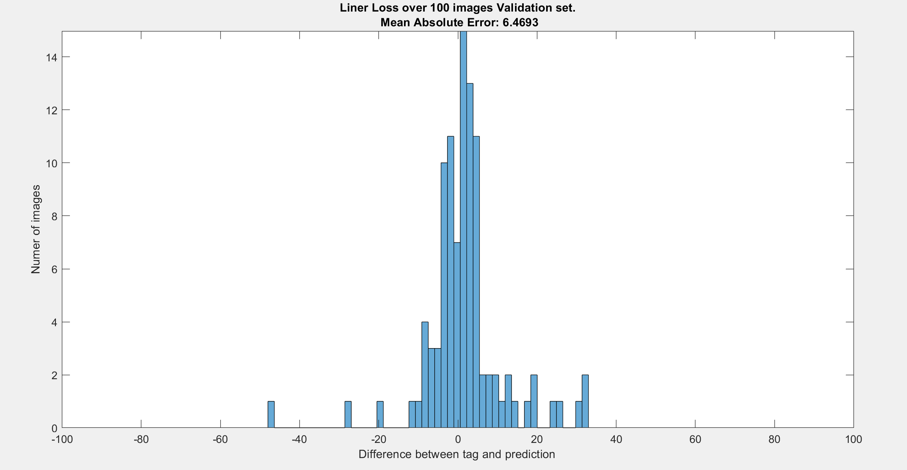

# My_Code

This project goal was to automatically extract the head and body angles of a rat in an arena, out of an image, using CNN. 
The images are frames taken out of a video of the rat. I used two net architectures: first, resNet, custom written, second, my own custom basic model of ANN with an Convolution unit.
Due to the fact that the nets output is cyclic (an angle between 0 to 359), I had to write a new regression layer and a corresponding loss function.
I will only include here the main code files in order to presentes the main ideas in the project. The project was written in Matlab due to the lab requirement.

Above is an input image with the arrows based on the outputs - head and body angles.

This graph shows the difference between predictions over tags of a 100 images untrained validation set.

Train_net: This folder contains the functions for training nets and validating them.

Data_preparetion: Contains a function for augmentation of the data.

Tagger: Tagging the data was necessary. I built a GUI for tagging data.

Resulets: contains the validations of the network and video results on raw data.

Predicte: predicting using two networks. More information below.

------------------ Using two nets for Minimizing running time of prediction ---------------------------------
Minimizing the running time of the prediction of the net had great importance to the project. Therefore I dropped the input image size from 200X200 pixels to 100X100 and afterwards to 50X50. While net performance on most of the 50X50 images were good, for a few images of a certain behavior of the rat, the 50X50 resolution was too low causing bad results. I implemented a function that can detect those parts where the 50X50 net fails (based on the variance of the first derivative of the net output), and used a 100X100 net only for predicting those “hard” parts.
This manipulation improved the prediction running time and accuracy. 

-------------------------------------------------------------------------------------------------------------

------------------ Cyclic regrassion layer ---------------------------------
 

-------------------------------------------------------------------------------------------------------------

