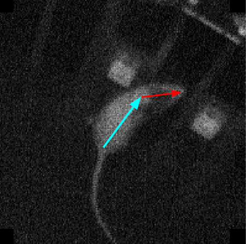
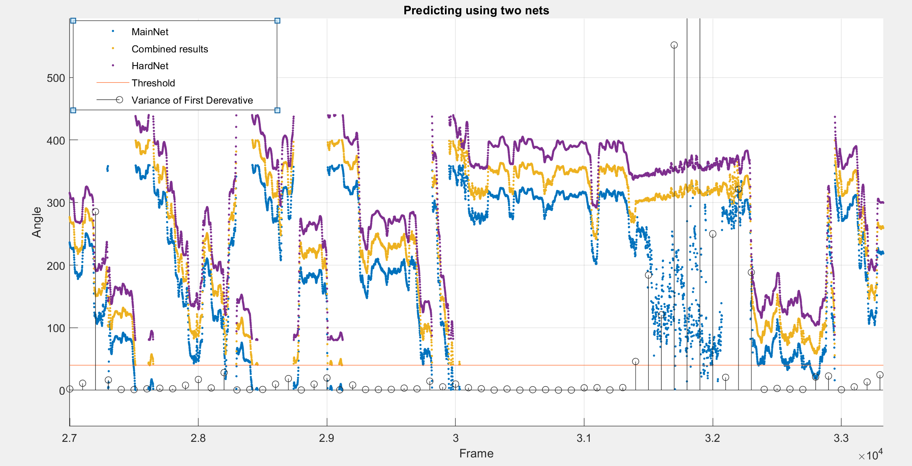
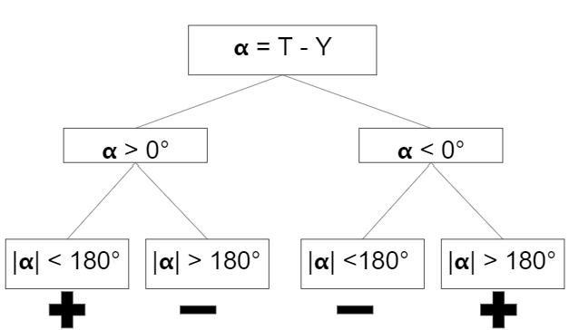
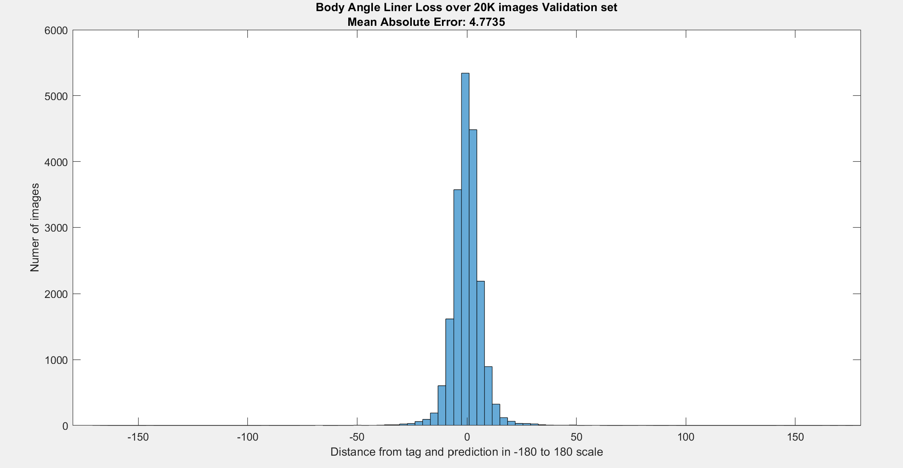

# Extracting the body & head angles of a rat out of a video frame using CNN

As part of a research studying rat behavior in an arena with auditory stimuli I developed an autonomous module for feature extraction. The module automatically recognizes the head and body angles of the rat, out of a video frame, using CNN and Computer Vision tools. Those rat features are critical for understanding certain behaviors of the rat during the data analysis. 

### Predictions examples, head and body angles, presented as arrows, over an input image.

### Genral Notes

- Tagging the data was necessary, therefore A GUI for tagging data was built.
- A database of 100K frames after augmentation. The frames were sampled from 16 different video, 100 frames from each.
- Seprate nets were used for the body and head angles detection.
- Two architectures were tested:
  - ResNet, custom written.
  - Custom - a basic CNN model.
- Due to the need in a cyclic output (an angle between 0° to 359°), implementation of a new regression layer and a corresponding loss function was required.
- Minimizing execution time (predicting time of the net) had a great importance, as this module is part of a larger data pipeline.

**I will only include here the main code files in order to present the main ideas in the project. The project was written in Matlab due to the lab requirement.**

## Methods
### The folders contains the code files, methods details and further explanations.

- **Train_net:** Contains the nets architectures, validation methods, the regression layer and the training function.

- **Data_preparetion:** Contains the data augmentation function and information.

- **Tagger:** Contains the tagger code with an example and further explanaions.

- **Predict:** Contains information and code for predicting using two networks. More information below and within the folder.

## Challenges

### Using two nets for minimizing execution time 

Minimizing the running time of the prediction of the net had great importance to the project. Therefore the input images were downsampled from 200X200 pixels to 100X100 and 50X50. While the net performances on most of the 50X50 images were good, for a few images the 50X50 resolution was too low and caused bad results. Those images were frames of a certain behavior of the rat. Only a net trained over 100X100 input image gave satisfying results. In order to keep the lower execution time of the net working on 50X50 input images, for most of the frames, I implemented a function that can detect those parts where the 50X50 net fails, and used a 100X100 net only for predicting those “hard” parts. This function based on the variance of the first derivative of the 50x50 net predictions.

The graph above shows the predictions of the networks over continuous frames. In blue are the predictions of the MainNet(faster net with 50X50 input), in purple the predictions of the HardNet(slower net with 100x100 input) and in yellow their combination. The HardNet and the combination values were added 80° and 40° respectively for each prediction in order to separate between the graphs. The graph also includes the variance of the first derivative over 100 frames of the MainNet and a threshold for this parameter. This parameter indicates on frames where the MainNet performs badly on, parts where the predictions are not continuous, like in frames 3.15 to 3.25. One can notice that the HardNet performs well on those parts, and therefore the use of both give better results. Important to mention that during inference time HardNet is predicting only those hard parts and not all frames.

**Further details in "Predict" folder.**

### Cyclic regression layer 

The need in cyclic output(an angle between 0° to 359°) required adjusting a regression layer. Due to the fact there were not any built in loss function for this output, I implemented a squared loss function and its derivative for the regression layer. Deriving the squared distance between target output (T) and prediction (Y) required the subtraction function
T - Y. Due to cyclicality this function is not trivial and the sign of it is case dependent.

This tree shows the sepration into cases.

## Results

#### Validation of body angle network, less than 5° mean error.

#### Video of un-tagged data
A prediction of the body angle network over 42000 frames, from a 15 second long video. Those frames are combined again for a video, with an arrow visualizing the predictions of the net. The inference latency is 0.03 milliseconds per frame.

**Further validation methods in "Train_net" folder.**

-------------------------------------------------------------------------------------------------------------

