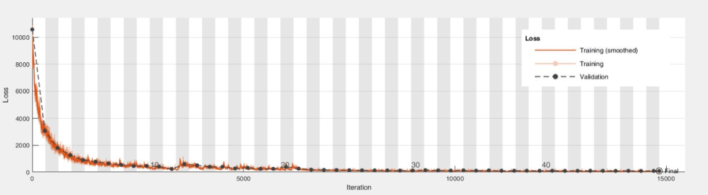
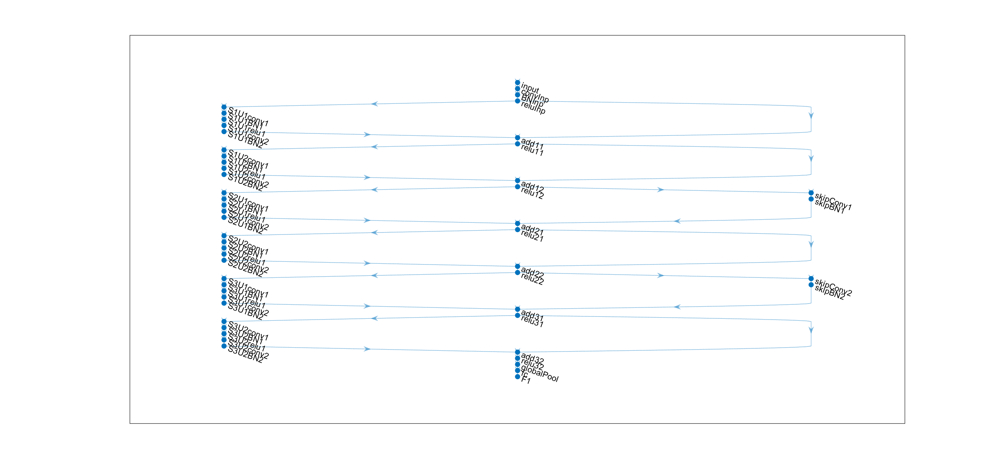

## Nets Architectures

Two architectures were tested, a ResNet model and a custom CNN model. The ResNet model was eventually chosen due to slightly better results.

### ResNet
The main branch of the net contains 5 sections for a net works on 50x50 images, and 6 sections for 100x100 images. The first section contains the image input layer and initial convolution layer. Afterwards there are 3 / 4 convolutional layer, with downsampling the spatial dimensions by a factor of 2. A final section with global average pooling, fully connected layer and my own implemented regression layer. There are residual connections around the convolutional units and the activation in the residual connections change size with respect to when there is downsampling between the layers.  

### Custom
The custom architectures that were tested contained the same initial and last sections as the ResNet, and between 6 to 10 sections of convolutional units. Each unit contains a pooling layer, convolution layer, normalization layer and activation layer, using both max and average pooling.

#### One of the ResNet's training prograss

#### The MainNet's Architecture

The MainNet width is 24.

## Validation

Each network that has been trained was validated by a few parameters.

#### Validation error
Regular validiation. A validation set sampled randomly from the DB, 20% of the DB.

#### Frames from outside of the DB
a set of 100 tagged images that is not part of the DB that the training and validation sets are taken from.
Those 100 frames are taken from a different video in order to see how well the net performs on a video that it has never learned any
frame from. 

#### Video of un-tagged data
a prediction of the net over 42000 frames, from a 15 second long video. Those frames are combined again for a video,
together with an arrow visualizing the predictions of the net(see an example in file "Validation_video.mp4"). This video also gives a
good validation about the net performance with frames from video that it did learn from before.  

### train_net.m
This function trains one net or more, and allows changing desired parameters of the net.
It contains two architectures: ResNet and Custom. It create all the validation for each net, graphs and video, and saves the net and
those validations of it in a unique folder. 

### F_One_regression_layer.m
Because of the cyclic output and due to the fact there were not any built in loss function for this output, I implement a squared loss
function and its derivative for the regression layer. Deriving the squared distance between tags (T) and predictions (Y) required the
subtraction function Y - T. Due to cyclicality it is not trivial and the sign of this function is case dependent.

This tree shows the sepration into cases.
